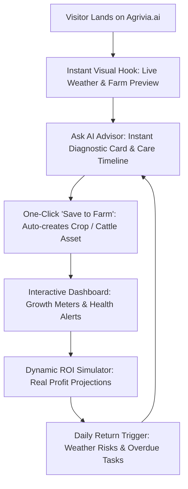
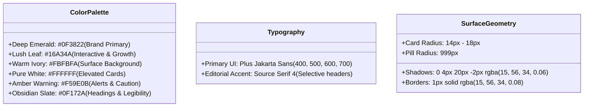
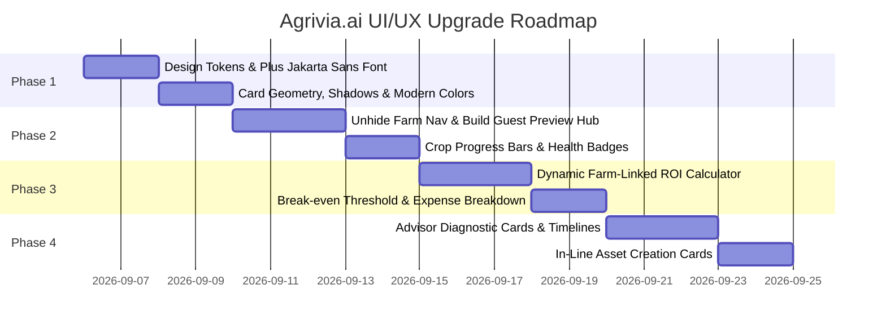

# Agrivia.ai — UI/UX Redesign Blueprint & Visual Specification

A comprehensive design and architectural proposal to elevate **Agrivia.ai** from a static text publication into a high-retention, visually stunning agricultural intelligence platform.

---

## 1. Executive Summary & Retention Analysis

### The Core Problem: Why Users Bounce Today
* **Aesthetic Disconnect**: The current muted newspaper styling (`#F4F0E6` beige paper, flat borders, heavy serif typography) conveys a dated print-pamphlet feel rather than a cutting-edge, intelligent ag-tech platform.
* **Hidden Value**: The Farm Dashboard is hidden (`<nav-farm hidden>`) until Google authentication, hiding the platform's best features from first-time visitors.
* **Passive Advisor Responses**: Advisor answers return plain-text paragraphs instead of structured, interactive diagnostic cards and watering schedules.
* **Disconnected Calculator**: The current calculator uses a hardcoded slider ($672/yr) with no connection to the user's actual crops or animals.

### The Retention Flywheel

---

## 2. Design System Tokens (Visual Refresh)

---

## 3. Visual Mockups & Page-by-Page Specifications

### Page 1: The Modern Farm Dashboard (The Daily Retention Hub)

The centerpiece of the user experience. Unhidden for all visitors, with interactive preview data for guests and real-time syncing for signed-in users.

#### Key Components:
1. **Farm Overview KPI Bar**:
   * Farmland Acreage (e.g. `12 Acres Active Farmland`)
   * Active Crops Count (`3 Crops Active`)
   * Herd / Livestock Count (`8 Cattle`)
   * Highlighted Alert Badge (`1 Frost Alert`)
2. **Crop Progress Cards**:
   * Lifecycle stage meters (e.g. *Roma Tomatoes: Day 34/75 · Flowering Stage · 65% to harvest*)
   * Soil and water health indicators (`Good`, `Needs Water`)
   * Quick action buttons (`View Details`, `Schedule Irrigation`)
3. **Cattle & Livestock Health**:
   * Active individual tracking (`Daisy: Optimal`, `Barnaby: Monitored`)
   * Health status trendline
4. **Live Local Weather & Frost Warning Widget**:
   * Real-time temperature, wind, humidity, and 5-day agro-weather forecast based on farm Zip code
5. **Seasonal Task Checklist**:
   * Task items tagged by urgency (`Done`, `Today`, `This Week`, `Due`)

---

### Page 2: The AI Farm Advisor (Interactive Assistant)

Evolving chat from a simple text feed into an intelligent, structured decision-support cockpit.

#### Key Components:
1. **Plant Health Diagnostic Cards**:
   * Confidence level badge (e.g. `92% Confidence: Early Blight`)
   * Visual symptom breakdown and botanical classification
2. **Recommended Treatment & Irrigation Timelines**:
   * Interactive multi-stage Gantt-style timeline for treatments (pruning, organic sprays, drip adjustments)
3. **One-Tap "Add to Farm Profile" Widget**:
   * Visual card embedded directly in the message stream that lets the user confirm adding the discussed crop or herd into their dashboard
4. **Smart Contextual Prompt Pills**:
   * Quick action pills (`Check frost risk`, `Analyze leaf photo`, `Recalculate cattle feed`)

---

### Page 3: Farm Yield & Financial ROI Simulator

A professional, dynamic financial calculator replacing the static `$672/yr` slider.

#### Key Components:
1. **Interactive Sliders**:
   * **Acreage**: Configurable from 0.5 to 500+ acres
   * **Expected Yield per Acre**: Custom unit-driven yield (bushels, lbs, tons)
   * **Market Selling Price**: Dynamic local market price per unit
   * **Operating Costs**: Seed, Fertilizer/Nutrients, Drip Irrigation, Labor
2. **Real-Time Financial Overview Cards**:
   * **Projected Gross Revenue**: $\text{Yield} \times \text{Price}$
   * **Total Operating Expenses**: Sum of input costs
   * **Net Profit**: $\text{Gross} - \text{Expenses}$
   * **Return on Investment (ROI %)**: Percentage yield gain
3. **Cost Breakdown Bar Chart & Break-Even Threshold**:
   * Visual stack of expenses versus the revenue break-even point

---

## 4. Implementation Phasing

